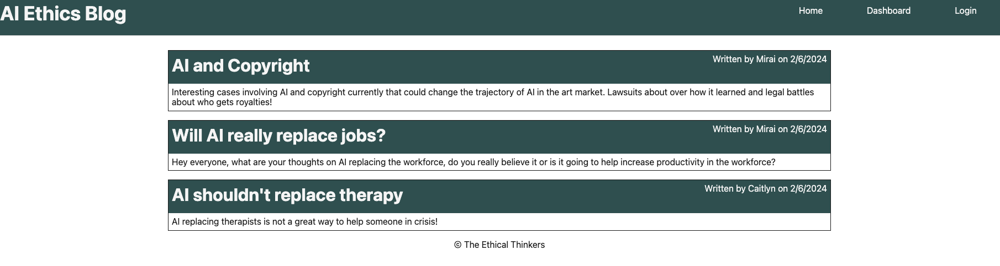
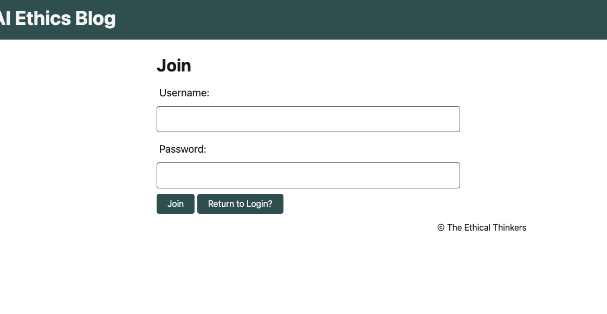
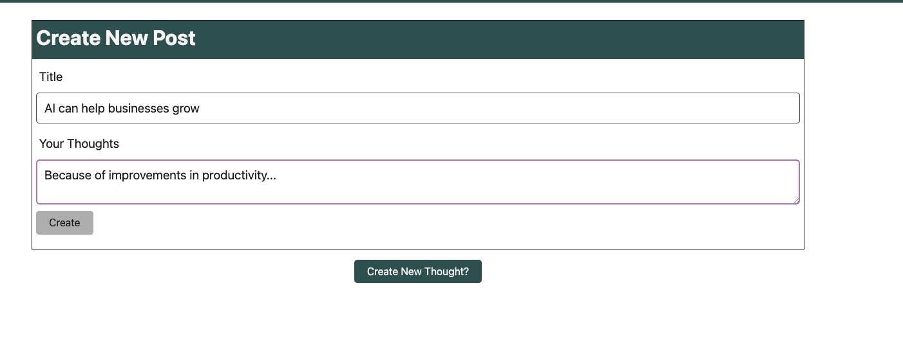
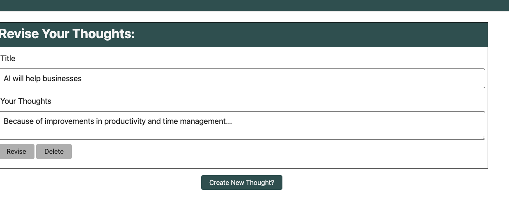
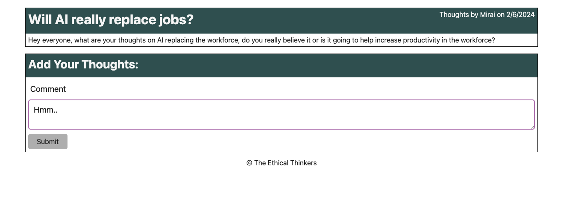
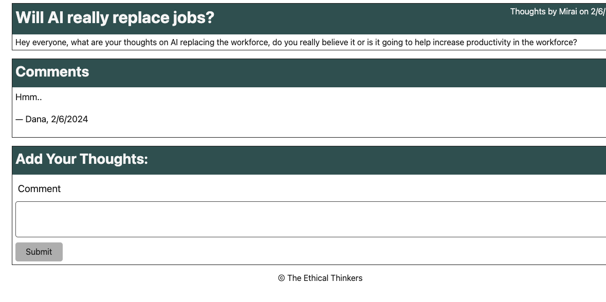

# tech_blog - AI Ethics

## Description

This is a simple blog for people to post about and respond to other's thoughts and opinions on the current/future ethical movements of AI. This is a dedicated blog to discussing AI in the light of ethics rather than just for technological advancements.

## Table of Contents (Optional)

- [Installation](#installation)
- [Usage](#usage)
- [Credits](#credits)
- [License](#license)
- [Features](#features)

## Installation

Click the following link to run the app:

## Usage

Login or Create an Account (Join) to create posts, comment on others post, revise and delete your own posts:

You do not need an account to see posts from the homepage.

## Credits

https://expressjs.com
https://handlebarsjs.com
https://sequelize.org/docs/v6/core-concepts/model-querying-basics/
https://www.mysql.com

https://www.sitepoint.com/a-beginners-guide-to-handlebars/
https://medium.com/@simply_stef/javascript-templates-handlebars-faf34a13f56e

https://www.youtube.com/watch?v=HxJzZ7fmUDQ
https://www.youtube.com/watch?v=3zVYH16yogQ
https://www.youtube.com/watch?v=6IRWsSJ_XPI
https://www.youtube.com/watch?v=6IRWsSJ_XPI
https://www.youtube.com/watch?v=S6VE2lsAGo0

https://github.com/leonhsu95/tech-blog
https://github.com/jakekelly44/tech-blog
https://github.com/ravensandcrows/social_media_platform

## License

MIT

## Features

Login/Logout
Signup/Join
Create Post
Delete Post
Edit Post
Comment on Posts
User Dashboard
